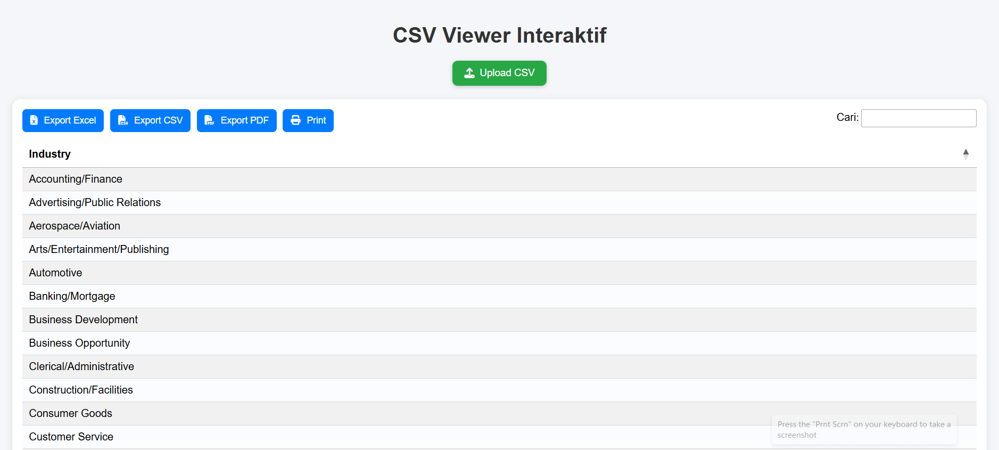
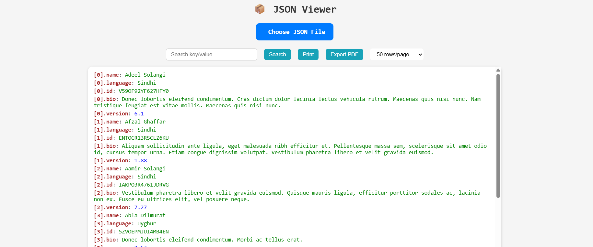
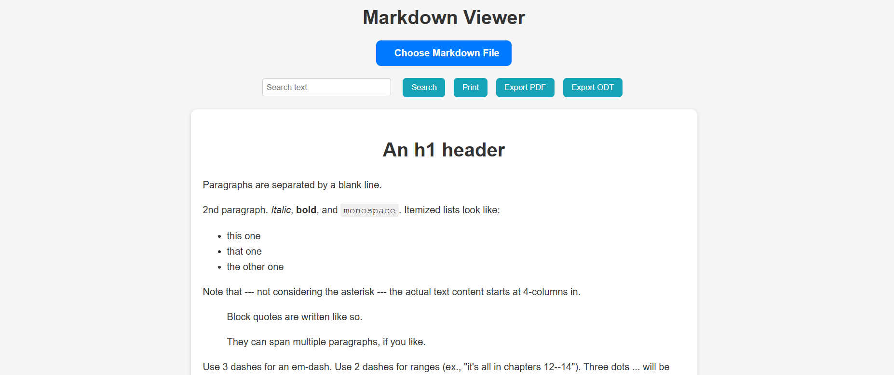
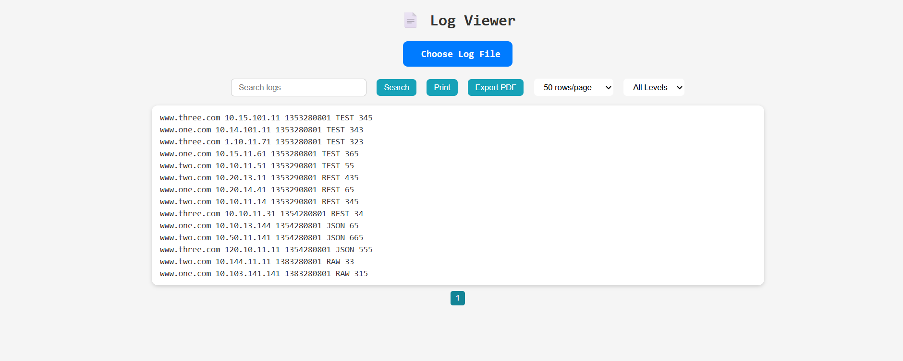
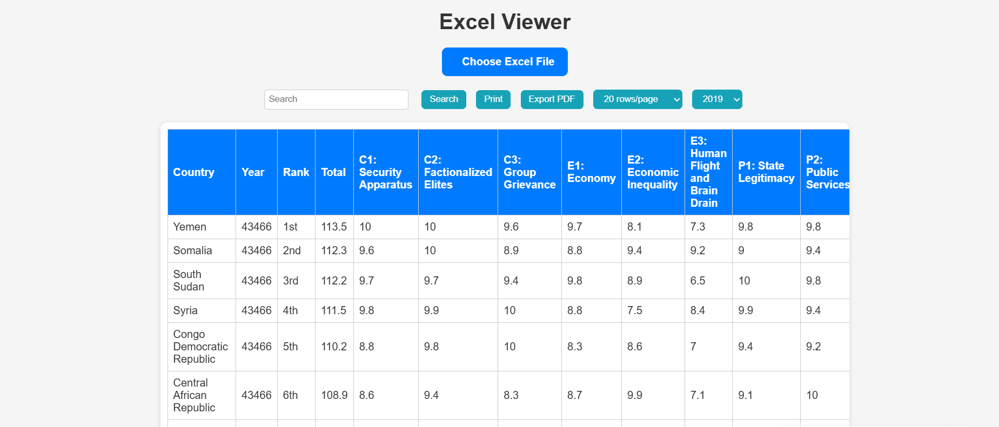

# Multi-Viewer Dashboard


A simple, interactive web dashboard to view and manage different file types: **CSV, JSON, Markdown, Log, and Excel**. Each viewer is built in a separate HTML file and includes useful features for analyzing and exporting data.

---

## Demo

Try the live demo here:  
[](https://s4rt4.github.io/multi-viewer)


---

## Features

### Dashboard
- Responsive card-based layout
- Font Awesome icons for each viewer
- Hover animations and tooltips
- Dark mode toggle
- Open viewers in new tabs

### CSV Viewer (`csv-viewer.html`)
- Upload CSV files
- Search and filter rows
- Pagination (20, 50, 100, 200, 500 rows per page)
- Export to PDF
- Print CSV data

**Screenshot:**


### JSON Viewer (`json-viewer.html`)
- Upload JSON files
- Search key/value
- Flattened view with data type highlighting (string, number, boolean, null)
- Copy individual entries
- Pagination
- Print and export to PDF

**Screenshot:**


### Markdown Viewer (`markdown-viewer.html`)
- Render Markdown files
- Syntax highlighting
- Search within Markdown
- Print and export to PDF

**Screenshot:**


### Log Viewer (`log-viewer.html`)
- Upload log files
- Search log lines
- Highlight log levels (ERROR, WARN, INFO)
- Filter by log level
- Pagination
- Copy individual log lines
- Print and export to PDF

**Screenshot:**


### Excel Viewer (`excel-viewer.html`)
- Upload Excel files (.xlsx)
- Display sheets and tables
- Search and filter
- Pagination
- Export to PDF
- Print Excel data

**Screenshot:**


---

## How to Use

1. Clone or download the repository:
   ```bash
   git clone https://github.com/username/multi-viewer-dashboard.git


